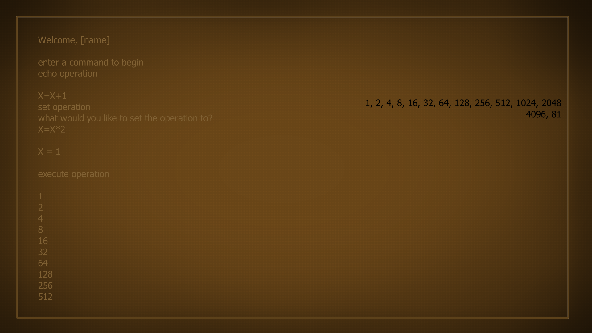

# Aperture Console
this is a console meant to look like that seen in Aperture Science Laboratories, featured during the end credits of Valve's "Portal 2" and on computer screens during the near-end of Valve's "Portal"

the program isn't in a working state *yet*, but as of now this is how the program is planned to look like:  
